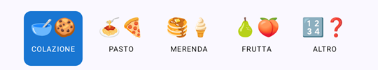
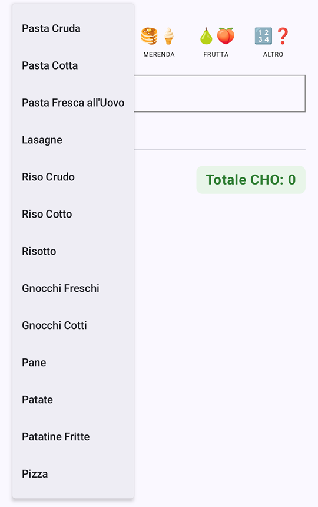
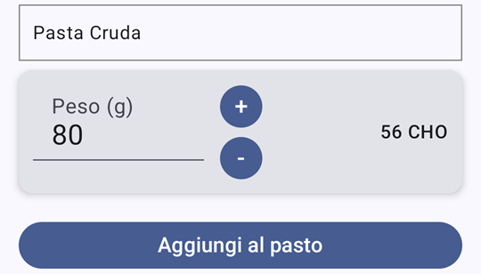
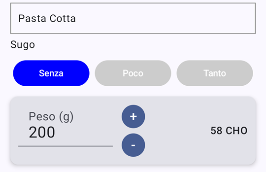
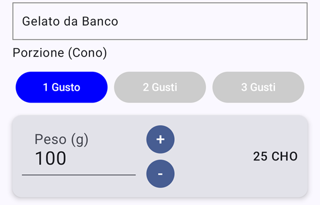
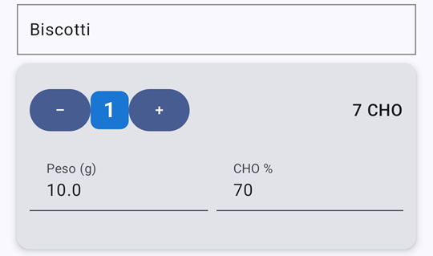
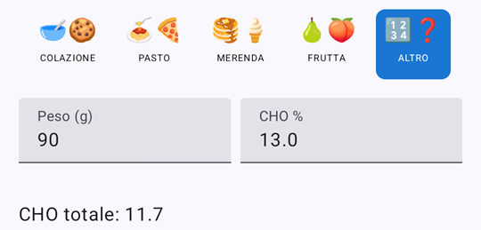
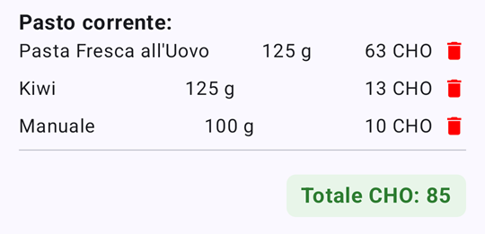

# PastoCHO
A simple app to calculate carbs (Italian)

Carbs taken from FatSecret and other online resources (NO LLM)

| Food                        | Carbs per 100g |
| --------------------------- | -------------- |
| Latte                       | 5              |
| Biscotti                    | 70             |
| Fette Biscottate            | 75             |
| Nutella (cucchiaino)        | 58             |
| Pasta Cruda                 | 70             |
| Pasta Cotta                 | 29             |
| Pasta Fresca all'Uovo       | 50             |
| Lasagne                     | 15             |
| Riso Crudo                  | 76             |
| Riso Cotto                  | 36             |
| Risotto                     | 36             |
| Gnocchi Freschi             | 35             |
| Gnocchi Cotti               | 28             |
| Pane                        | 50             |
| Patate                      | 20             |
| Patatine Fritte             | 30             |
| Pizza                       | 50             |
| Gelato da Banco             | 25             |
| Crepes                      | 30             |
| Crostata Marmellata (circa) | 64             |
| Torta Cioccolato (circa)    | 54             |
| Torta di Mele (circa)       | 40             |
| Tiramisù (circa)            | 25             |
| Torta alla Crema (circa)    | 25             |
| Anguria/Melone              | 8              |
| Albicocca                   | 7              |
| Prugna                      | 9              |
| Pesca                       | 10             |
| Mandarino                   | 13             |
| Banana                      | 20             |
| Kiwi                        | 10             |
| Pera                        | 12             |
| Uva                         | 15             |
| Mela                        | 12             |
| Fragole                     | 8              |
| Macedonia di Frutta         | 12             |

Header course selection

Drop down menu for food selection

Weight calculation for raw food

Customizations for cooked food: by additional sauce

Cooked pasta: 100%, -10%, -20%

Cooked rice: 100%, -15%, -25%

Risotto: 100%, -5%, -10%

Gnocchi cooked: 100%, -10%, -20%

Crepes Nutella: -40% (no Nutella), 100%, +20%

By serving size

Gelato da banco: -20%, 100%, +25% 

Itemized

By item size

Albicocca: small 100%, large +80%

Prugna: -10%, 100%, +50%

Pesca: -10%, +10%

Mandarino: -15%, 100%, +15%

Macedonia du frutta: 100%, +25% if sugared

Calculator for products with carbs information

Total calculation with deletion icon

